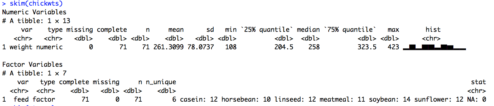
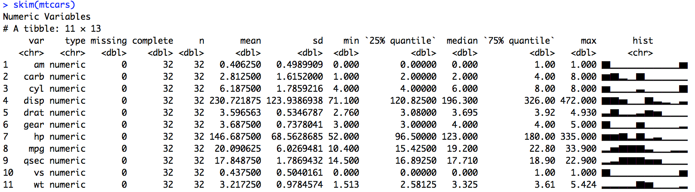
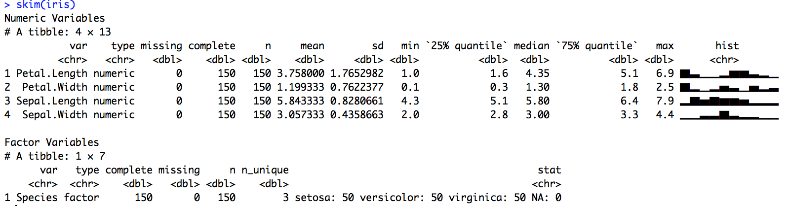
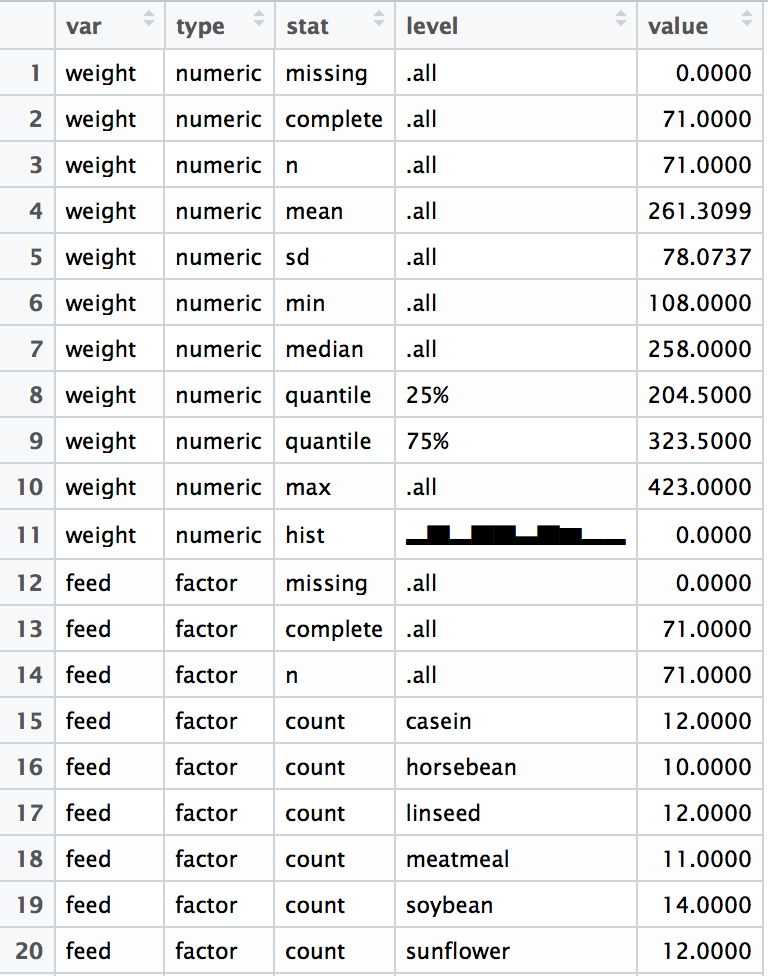

# skimr


The goal of skimr is to provide a frictionless approach to dealing with summary statistics iteratively and interactively as part of a pipeline, and that conforms to the principle of least surprise. 

`skimr` provides summary statistics that you can skim quickly to understand and your data and see what may be missing. It handles different data types (numerics, factors, etc), and returns a skimr object that can be piped or displayed nicely for the human reader. 

See our blog post [here](https://rawgit.com/ropenscilabs/skimr/master/blog.html).

## Installation


``` r
# install.packages("devtools")
devtools::install_github("ropenscilabs/skimr")
```


## Skim statistics in the console

**Nicely separates numeric and factor variables:**  

  
<br>

**Many numeric variables:**  

  
<br>
 
**Another example:**  


  
<br>

## skim_df object (long format)

By default `skim` prints beautifully in the console, but it also produces a long tidy-format df that can be computed on. 

```r
a <-  skim(chickwts)
dim(a)
# [1] 22  5
View(a)
```

<center></center>


## Compute on the full skim_df object

```r
> skim(mtcars) %>% filter(stat=="hist")
# A tibble: 11 × 5
     var    type  stat      level value
   <chr>   <chr> <chr>      <chr> <dbl>
1    mpg numeric  hist ▂▅▇▇▇▃▁▁▂▂     0
2    cyl numeric  hist ▆▁▁▁▃▁▁▁▁▇     0
3   disp numeric  hist ▇▇▅▁▁▇▃▂▁▃     0
4     hp numeric  hist ▆▆▇▂▇▂▃▁▁▁     0
5   drat numeric  hist ▃▇▂▂▃▆▅▁▁▁     0
6     wt numeric  hist ▂▂▂▂▇▆▁▁▁▂     0
7   qsec numeric  hist ▂▃▇▇▇▅▅▁▁▁     0
8     vs numeric  hist ▇▁▁▁▁▁▁▁▁▆     0
9     am numeric  hist ▇▁▁▁▁▁▁▁▁▆     0
10  gear numeric  hist ▇▁▁▁▆▁▁▁▁▂     0
11  carb numeric  hist ▆▇▂▁▇▁▁▁▁▁     0
```

## Specify your own statistics
