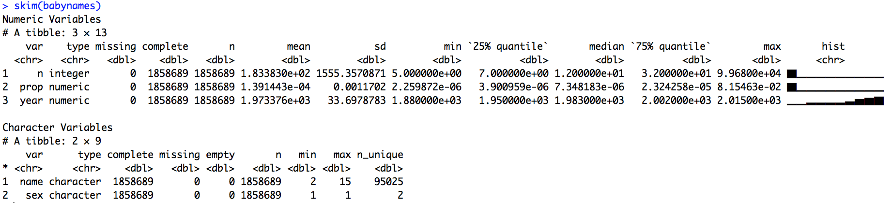

# skimr

[](https://travis-ci.org/ropenscilabs/skimr)

The goal of skimr is to provide a frictionless approach to dealing with summary statistics iteratively and interactively as part of a pipeline, and that conforms to the principle of least surprise. 

`skimr` provides summary statistics that you can skim quickly to understand and your data and see what may be missing. It handles different data types (numerics, factors, etc), and returns a skimr object that can be piped or displayed nicely for the human reader. 

See our blog post [here](https://rawgit.com/ropenscilabs/skimr/master/blog.html).

## Installation


``` r
# install.packages("devtools")
devtools::install_github("hadley/colformat")
devtools::install_github("ropenscilabs/skimr")
```


## Skim statistics in the console

- added missing, complete, n, sd
- reports numeric/int/double separately from factor/chr
- handles dates, logicals
- uses [Hadley's colformats](https://github.com/hadley/colformat), specifically `colformats::spark-bar()`

**Nicely separates numeric and factor variables:**  

  
<br>

**Many numeric variables:**  

  
<br>
 
**Another example:**  


  
<br>

## skim_df object (long format)

By default `skim` prints beautifully in the console, but it also produces a long, tidy-format skim_df object that can be computed on. 

```r
a <-  skim(chickwts)
dim(a)
# [1] 22  5
View(a)
```


## Compute on the full skim_df object

```r
> skim(mtcars) %>% filter(stat=="hist")
# A tibble: 11 × 5
     var    type  stat      level value
   <chr>   <chr> <chr>      <chr> <dbl>
1    mpg numeric  hist ▂▅▇▇▇▃▁▁▂▂     0
2    cyl numeric  hist ▆▁▁▁▃▁▁▁▁▇     0
3   disp numeric  hist ▇▇▅▁▁▇▃▂▁▃     0
4     hp numeric  hist ▆▆▇▂▇▂▃▁▁▁     0
5   drat numeric  hist ▃▇▂▂▃▆▅▁▁▁     0
6     wt numeric  hist ▂▂▂▂▇▆▁▁▁▂     0
7   qsec numeric  hist ▂▃▇▇▇▅▅▁▁▁     0
8     vs numeric  hist ▇▁▁▁▁▁▁▁▁▆     0
9     am numeric  hist ▇▁▁▁▁▁▁▁▁▆     0
10  gear numeric  hist ▇▁▁▁▆▁▁▁▁▂     0
11  carb numeric  hist ▆▇▂▁▇▁▁▁▁▁     0
```

## Works with strings!




## Specify your own statistics


```r

 funs <- list(iqr = IQR,
    quantile = purrr::partial(quantile, probs = .99))
  skim_with(numeric = funs, append = FALSE)
  skim_v(iris$Sepal.Length)
  
#  A tibble: 2 × 4
#      type     stat level value
#     <chr>    <chr> <chr> <dbl>
# 1 numeric      iqr  .all   1.3
# 2 numeric quantile   99%   7.7

```
## Limitations of current version

Currently the print methods are still in early stages of development. Printing is limited to numeric, character,
and factor data types. Therefore although additional types that are supported by skim() 
and skim_v() will not display with the default printing.  To view these you may view and manipulate the 
skim object.

At the moment in addition to the three types with print support complex, logical, Date, POSIXct, and ts classes
are supported with skim_v methods and the results are in the skim object.

We are also aware that both print.skim and print.data.frame (used for the skim object)  do not handle 
significant digits incorrectly.  

### Windows support for spark histograms

Windows cannot print the spark-histogram characters when printing a data-frame. For example, 
`"▂▅▇"` is printed as `"<U+2582><U+2585><U+2587>"`. This longstanding problem [originates in 
the low-level code](http://r.789695.n4.nabble.com/Unicode-display-problem-with-data-frames-under-Windows-td4707639.html) 
for printing dataframes. These values do show up when printing a data-frame created by 
`skim()` as a list (`as.list()`) or as a matrix (`as.matrix()`).


## Contributing

We wecome issue reports and pull requests including adding support for different variable classes. 
